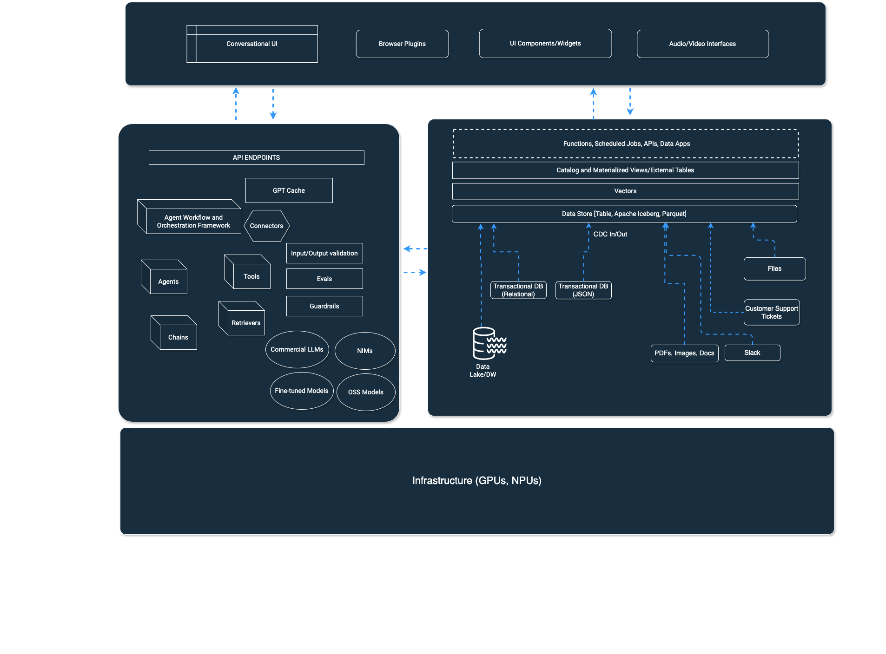

# 0. Introduction

Since the advent of generative AI, there has been a surge of companies experimenting with and building applications with AI features, but the requirements for large enterprises are inherently different that entails stricter rules around accuracy, explainability, etc., with speed and scale.

The Seven-Factor Enterprise AI App, inspired by the[ Twelve-Factor App](https://12factor.net/) document for cloud computing, is  a methodology to build enterprise grade generative AI applications.

The Seven-Factor App is agnostic to the underlying choices of technologies and programming languages and is meant to be treated as a guideline for best practices but can ultimately be configured based on individual requirements for different enterprises.

### Background

The document is based on the experiences of directly working with and helping several small and large companies building generative AI applications using[ SingleStore](https://singlestore.com/) as the underlying data source. These companies include but are not limited to multi-billion dollar tech and financial services companies. However, this[ repo](https://github.com/madhukarkumar/sevenfactorapp) is open for collaboration and contribution from other developers, engineers and architects who have built reality-scale enterprise-grade generative AI applications and have other notes to add. We will capture those notes and case studies in a separate chapter called case studies after step VII as they become available.

<figure><figcaption>
High Level Reference Architecture of Enterprise AI using Seven-Factor Enterprise AI Apps
</figcaption></figure>
